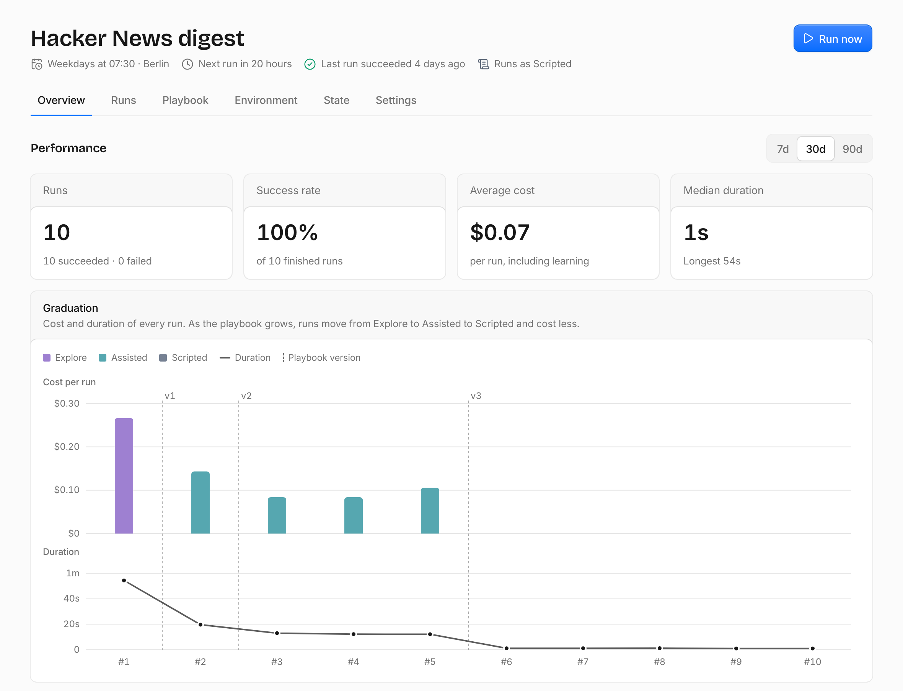

  <picture>
    <source media="(prefers-color-scheme: dark)" srcset="branding/lockup/lockup-on-dark.svg">
    
  </picture>

  
Self-hosted agentic jobs that graduate to scripts.

  <a href="https://umpteenth.dev">Website</a> · <a href="https://umpteenth.dev/getting-started/introduction/">Documentation</a> · <a href="https://umpteenth.dev/getting-started/installation/">Install</a>

 

Umpteenth runs the chores you'd otherwise do by hand for the umpteenth time, such as a weekday digest or a Monday report.
You describe a job once in plain language, and an LLM agent does it in a disposable sandbox with shell tools and the MCP servers you connect.

What makes Umpteenth different is that jobs get better at their work.
After every run, the agent's learnings become playbook changes and tested scripts, and once a job has taken the same steps three runs in a row, it graduates to a script that runs without the agent and costs close to nothing.
If the script fails, the agent takes over in the same sandbox and repairs it.

<picture>
  <source media="(prefers-color-scheme: dark)" srcset="docs/src/assets/screens/job-overview-dark.png">
  
</picture>

## Setup

Umpteenth runs with Docker Compose, or on Kubernetes with the Helm chart.

Follow the [installation guide](https://umpteenth.dev/getting-started/installation/) to get started.

## Contribute

You're very welcome to contribute to Umpteenth! Please follow the [contribution guide](CONTRIBUTING.md) to get started.
